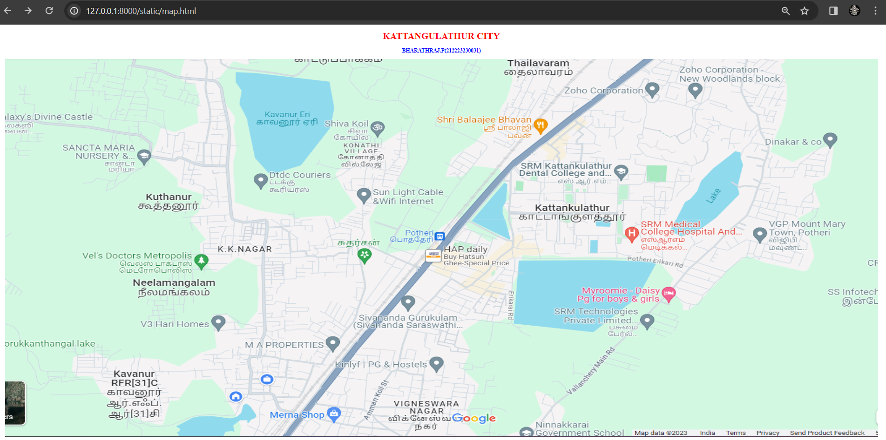
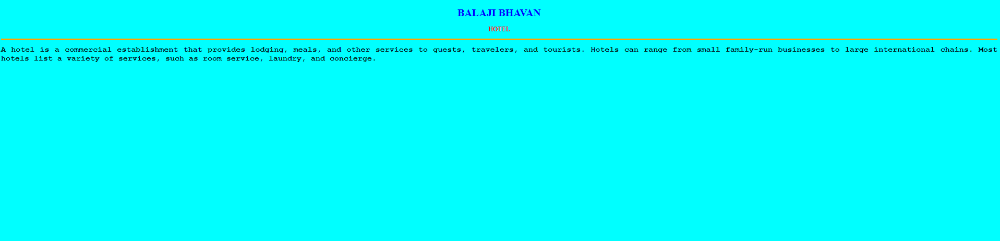
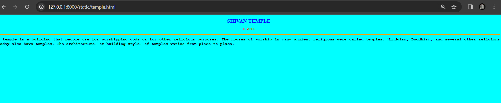

# Ex04 Places Around Me
## Date: 

## AIM
To develop a website to display details about the places around my house.

## DESIGN STEPS

### STEP 1
Create a Django admin interface.

### STEP 2
Download your city map from Google.

### STEP 3
Using ```<map>``` tag name the map.

### STEP 4
Create clickable regions in the image using ```<area>``` tag.

### STEP 5
Write HTML programs for all the regions identified.

### STEP 6
Execute the programs and publish them.

## CODE
```
map.html

<!DOCTYPE html>
<html lang="en">
<head>
<title>My City</title>
</head>
<body>
<h1 align="center">
<font color="red"><b>KATTANGULATHUR CITY</b></font>
</h1>
<h3 align="center">
<font color="blue"><b>BHARATHRAJ.P(212223230031)</b></font>
</h3>
<center>

<map name="MyCity">
<area shape="rectangle" coords="2000,350,2200,400" href="college.html" title="SRM College">
<area shape="rectangle" coords="1850,280,1800,225" href="hotel.html" title="Balaji Bhavan">
<area shape="rectangle" coords="1200,800,1400,900" href="school.html" title="Sivananda school">
<area shape="rectangle" coords="1200,280,1300,225" href="temple.html" title="Shivan temple">
<area shape="rectangle" coords="2380,150,2200,90" href="office.html" title="ZOHO corporation">
</map>
</center>
</body>
</html>

college.html

<!DOCTYPE html>
<html>
    <head>
        <title>
            COLLEGE
        </title>

    </head>
    <body bgcolor ="cyan">
        <h1 align="center">
            <font color = "blue">
                <b>
                    SRM COLLEGE
                </b>
            </font>
            <h1>
            <h3 align="center">
            <font color = "red">
                <b>
                   COLLEGE
                </b>
            </font>
            
        </h3>
<hr size="3" color="orange">
<p align="justify">
    <font face="Courier New" size="5">
        <b>
            an institution of higher learning, especially one providing a general or liberal arts education rather than technical or professional training.: Compare university. a constituent unit of a university, furnishing courses of instruction in the liberal arts and sciences, usually leading to a bachelor's degree.
        </b>
    </font>
</p>
    </body>
</html>

hotel.html

<!DOCTYPE html>
<html>
    <head>
        <title>
            HOTEL
        </title>

    </head>
    <body bgcolor ="cyan">
        <h1 align="center">
            <font color = "blue">
                <b>
                    BALAJI BHAVAN
                </b>
            </font>
            <h1>
            <h3 align="center">
            <font color = "red">
                <b>
                   HOTEL
                </b>
            </font>
            
        </h3>
<hr size="3" color="orange">
<p align="justify">
    <font face="Courier New" size="5">
        <b>
            A hotel is a commercial establishment that provides lodging, meals, and other services to guests, travelers, and tourists. Hotels can range from small family-run businesses to large international chains. Most hotels list a variety of services, such as room service, laundry, and concierge.
        </b>
    </font>
</p>
    </body>
</html>

school.html

<!DOCTYPE html>
<html>
    <head>
        <title>
            SCHOOL
        </title>

    </head>
    <body bgcolor ="cyan">
        <h1 align="center">
            <font color = "blue">
                <b>
                    SIVANANDA SCHOOL
                </b>
            </font>
            <h1>
            <h3 align="center">
            <font color = "red">
                <b>
                   SCHOOL
                </b>
            </font>
            
        </h3>
<hr size="3" color="orange">
<p align="justify">
    <font face="Courier New" size="5">
        <b>
            School is the place where we learn to read and write. It is the most crucial place for a student, and it helps us to learn new things. The teachers are always helpful and teach us important things in life. We must always be regular to school as missing classes can lead to problems during exams.21
        </b>
    </font>
</p>
    </body>
</html>

temple.html

<!DOCTYPE html>
<html>
    <head>
        <title>
            TEMPLE
        </title>

    </head>
    <body bgcolor ="cyan">
        <h1 align="center">
            <font color = "blue">
                <b>
                    SHIVAN TEMPLE
                </b>
            </font>
            <h1>
            <h3 align="center">
            <font color = "red">
                <b>
                   TEMPLE
                </b>
            </font>
            
        </h3>
<hr size="3" color="orange">
<p align="justify">
    <font face="Courier New" size="5">
        <b>
            A temple is a building that people use for worshipping gods or for other religious purposes. The houses of worship in many ancient religions were called temples. Hinduism, Buddhism, and several other religions today also have temples. The architecture, or building style, of temples varies from place to place.
        </b>
    </font>
</p>
    </body>
</html>

office.html

<!DOCTYPE html>
<html>
    <head>
        <title>
            OFFICE
        </title>

    </head>
    <body bgcolor ="cyan">
        <h1 align="center">
            <font color = "blue">
                <b>
                    ZOHO Corporation
                </b>
            </font>
            <h1>
            <h3 align="center">
            <font color = "red">
                <b>
                   OFFICE
                </b>
            </font>
            
        </h3>
<hr size="3" color="orange">
<p align="justify">
    <font face="Courier New" size="5">
        <b>
            Zoho CRM acts as a single repository to bring your sales, marketing, and customer support activities together, and streamline your process, policy, and people in one platform. It looks like you're in the united states based on your IP. Your data will be stored in the US data center.

        </b>
    </font>
</p>
    </body>
</html>

```

## OUTPUT








## RESULT
The program for implementing image maps using HTML is executed successfully.
